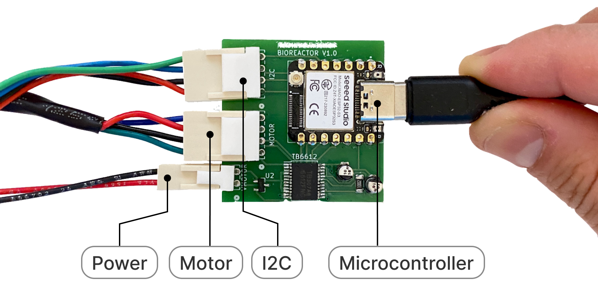

## Spectral Sensor

In this folder, you'll find:

- **SensorSetup:** How to use up a 10-channel light sensor.

Read below if you want to learn how to make a new tool!

## Introduction

Making a sensor tool on Jubilee is easy - grab a sensor, bolt it down onto a tool head, and use it!

We are using a modular approach to integrate sensor(s). Each sensor is wired to its own microcontroller node that is then connected to a laptop/raspberry pi for orchestration within the science-jubilee framework.

First, program the node so that it communicates with science-jubilee via serial. The node is a custom pcb with Seeed Xiao as its brain and has a I2C connector.

### Installing CircuitPython on ESP32 (OPTIONAL EXERCISE)

You can skip down to the science jubilee import cell below if you don't want to learn about installing firmware!

As of February 2026, we can use the web [CircuitPython installer](https://circuitpython.org/board/seeed_xiao_esp32s3/) (note: browser should support serial communication) to install CircuitPython (v10.0.3).

### Adding CircuitPython firmware

In the `CIRCUITPY` device there should be a `code.py`, a `boot.py`, a `boot.out` (used for debugging only), a `lib` directory, and a `drivers` directory.

The firmware uses a JSON-RPC protocol and has three main parts:

- [`boot.py`](xiao_firmware/boot.py) — runs once at startup. Defines the module identity (`MODULE_ID`, `MODULE_NAME`) and lists which drivers to load. It initializes a `HardwareRegistry` and loads each driver to register sensors and actuators.
- [`drivers/`](xiao_firmware/drivers/) — modular hardware drivers. Each file (e.g. [`i2c_sensors.py`](xiao_firmware/drivers/i2c_sensors.py), [`onboard_led.py`](xiao_firmware/drivers/onboard_led.py)) has a `register(hw)` function that initializes a hardware component and registers it with the `HardwareRegistry`. To add new hardware, create a new driver file and add its name to the `DRIVERS` list in `boot.py`.
- [`code.py`](xiao_firmware/code.py) — the main loop. Handles JSON-RPC serial communication, dispatches commands (e.g. `blink`, `read_sensor`, `get_property`, `set_property`), and returns structured responses.

`code.py` can be shared among microcontrollers while `boot.py` and `drivers/` should be configured per module.

We want to setup AS7341 spectrometer. It comes with its own CircuitPython library, which needs to be added to the `lib` folder first.

***Alternatively***, copy the entire `lib` folder containing all current libraries available for CircuitPython. Adafruit maintains and updates these libraries and the latest bundle can be found [here](https://circuitpython.org/libraries) (note that there might be compatibility issue).

#### Adding firmware

Copy [everything in this folder](xiao_firmware) into CIRCUITPY.

### Making and using a new tool

When working with a new tool, you will need to add tool definition to Science Jubilee. Check [extending-science-jubilee](../extending-science-jubilee/readme.md) for more detail!

The spectral sensor is already added to the science-jubilee library.### Installing CircuitPython on ESP32 (OPTIONAL EXERCISE)

You can skip down to the science jubilee import cell below if you don't want to learn about installing firmware!

As of February 2026, we can use the web [CircuitPython installer](https://circuitpython.org/board/seeed_xiao_esp32s3/) (note: browser should support serial communication) to install CircuitPython (v10.0.3).

